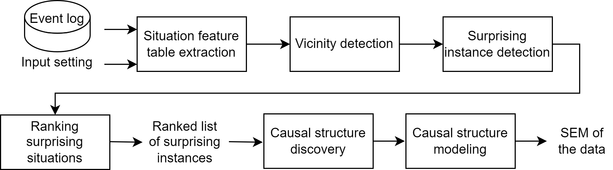

# Interactive Tool for Process Improvement Opportunity Detection and Causal Modeling

This tool can be used to detect process improvement opportunities and their root-cause.
The main idea of process improvement opportunity detection is to detect surprising behavior in existing processes 
which means looking for behavior that is significantly different from the expected behavior of other similar process situations.
The approach consists of four main steps:

1. Situation feature table extraction
2. Vicinity Detection
    - Similarity based
    - Classification
    - Clustering
3. Surprising Instance Detection
4. Root-Cause Analysis



## Installation

**Requirements**

The Tool requires the following python packages:

- [pm4py](https://pm4py.fit.fraunhofer.de/)
- [numpy](https://numpy.org/)
- [pandas](https://pandas.pydata.org/)
- [scikit-learn](https://scikit-learn.org/)
- [networkx](https://networkx.org/)
- [matplotlib](https://matplotlib.org/)
- [cdt](https://github.com/FenTechSolutions/CausalDiscoveryToolbox/) (for causal structure discovery)
- [dowhy](https://github.com/py-why/dowhy/) (for causal effect estimation)

You can install the python dependencies using:

```
pip install -r requirements.txt
```

In addition, you need an [R](https://r-project.org/) installation for the cdt package and the following R libraries:
- pcalg
- kpcalg
- bnlearn
- sparsebn
- SID
- CAM
- D2C
- RCIT

For more information about the R installation and the additional libraries, check the [cdt documentation](https://github.com/FenTechSolutions/CausalDiscoveryToolbox)

**Run the application**

After installing the required dependencies, you can run the application using one of the following commands: 

*Run an evaluation*:
```
src > py main.py
```

*Run the frontend*:
```
frontend > py manage.py runserver 0.0.0.0:<port>
```

You can then access the application via localhost:<port> in your browser.

*Run the application using the Docker image*:
```
docker run -p 33333:33333 ghcr.io/ckohlschm/detecting-surprising-instances:1.0.0
```

You can then access the application via localhost:33333 in your browser.

## Functionality

The tool provides a dashboard for process improvement opportunity detection. You can import an event log, select the desired method and corresponding parameters
to detect surprising behavior in the process.

### Situation Feature extraction
First, the event log is converted into tabular data. To extract the tabular data, the application transforms and enriches the event log into process situations. 
You can choose a target feature and a set of descriptive features as input parameters. Depending on the chosen target feature, a situation is either
a process instance (case) or a prefix of it.

### Vicinity Detection
Then, the tool identifies similar process behavior. For each situation, the tool identifies a set of similar situations, which we call the vicinity of that
situation. The tool support three methods for vicinity detection:

- Similarity graph
- Classification
- Clustering

**Similarity graph**
The similarity graph represents similar process situations by connecting them with an edge in a graph. Then, the application uses community detection 
to identify the sets of similar situations.

**Classification**
The classification method currently supports a decision tree classifier to identify the sets of similar situations. Each leaf of the decision tree
represents one set of similar situations. 

**Clustering**
The clustering method uses the k-means clustering algorithm to identify the similar process situations. Each cluster represents a vicinity.

### Surprising Instance Detection
The third step is the surprising instance detection. For categorical target features, the application identifies the surprising the most frequent attribute in each vicinity. The surprising instances are those situations where the attribute is different from the most frequent attribute.

For numerical target features, you can select one of two different methods:

Threshold:
You can select a specific threshold for numerical target attributes. The surprising situations are those situations where the difference between the 
actual situation performance and the expected performance of other similar situations is higher than the specified threshold.

Boxplot:
You can select the boxplot method to identify the surprising instances as those situations where the actual performance is outside of the
interquartile range of a vicinity.

### Root-Cause Analysis
To find the cause of the surprising behavior of the process for the set of surprising situations in each vicinity, the application first discovers the
structure of the causal relationships among the process features. This structure is visualized as a graph object called the Causal Structure.
The Causal Structure of the data is discovered by the application in a data-driven manner and can and then modified. As the final step, we estimate
the strength of the causal relationships in the causal structure. The estimated effects can be used to find the interventions in the process that result
in the desired behavior.
